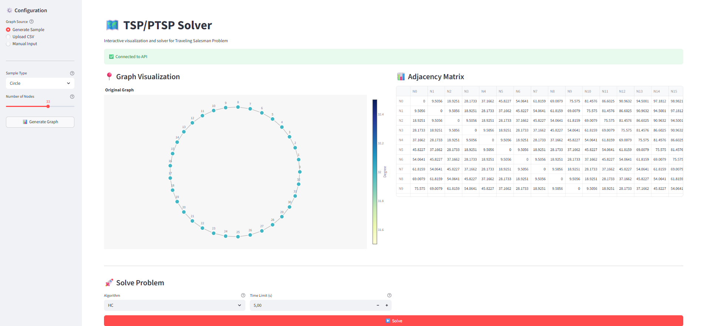
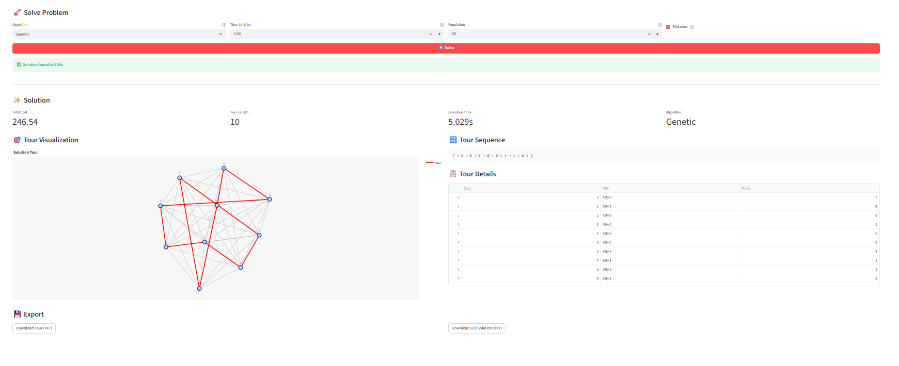
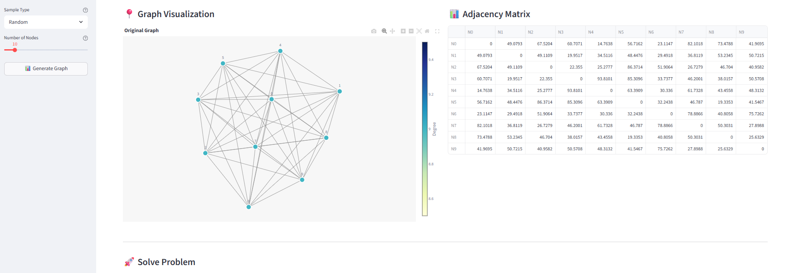

# TSP and PTSP Solver

FastAPI + Streamlit app for solving and visualizing TSP/PTSP with Random, HC, Genetic, and MCTS methods.

## Screenshots





## Quick Setup

### Option A: Docker (recommended)

```bash
docker-compose up --build
```

- API: http://localhost:8000
- Frontend: http://localhost:8501
- API docs: http://localhost:8000/docs

### Option B: Local

```bash
# install deps
uv install -e ".[dev]"

# terminal 1: backend
python services/api/run.py

# terminal 2: frontend
streamlit run services/frontend/streamlit_app.py
```

## Development Commands

```bash
make test
make lint
make type-check
make docker-up
make docker-down
```

## Structure Overview

```text
services/
  api/              API service (FastAPI backend)
    app/            Routes, schemas, services
    analytics/      TSP/PTSP algorithms (domain, genetic, mcts)
    tests/          API test suite
    Dockerfile.python
    run.py
  frontend/         Frontend service (Streamlit UI)
    helpers/        API client, graph rendering, generators
    streamlit_app.py
    Dockerfile
  go-worker/        Go algorithm worker service
    go-worker/      Go source code
    Dockerfile
docker-compose.yml  Multi-service orchestration
```

## Main Endpoints

- `POST /api/v1/tsp/solve`
- `POST /api/v1/tsp/upload`
- `POST /api/v1/tsp/visualize`
- `GET /api/v1/tsp/health`
- `GET /api/v1/ptsp/health`
